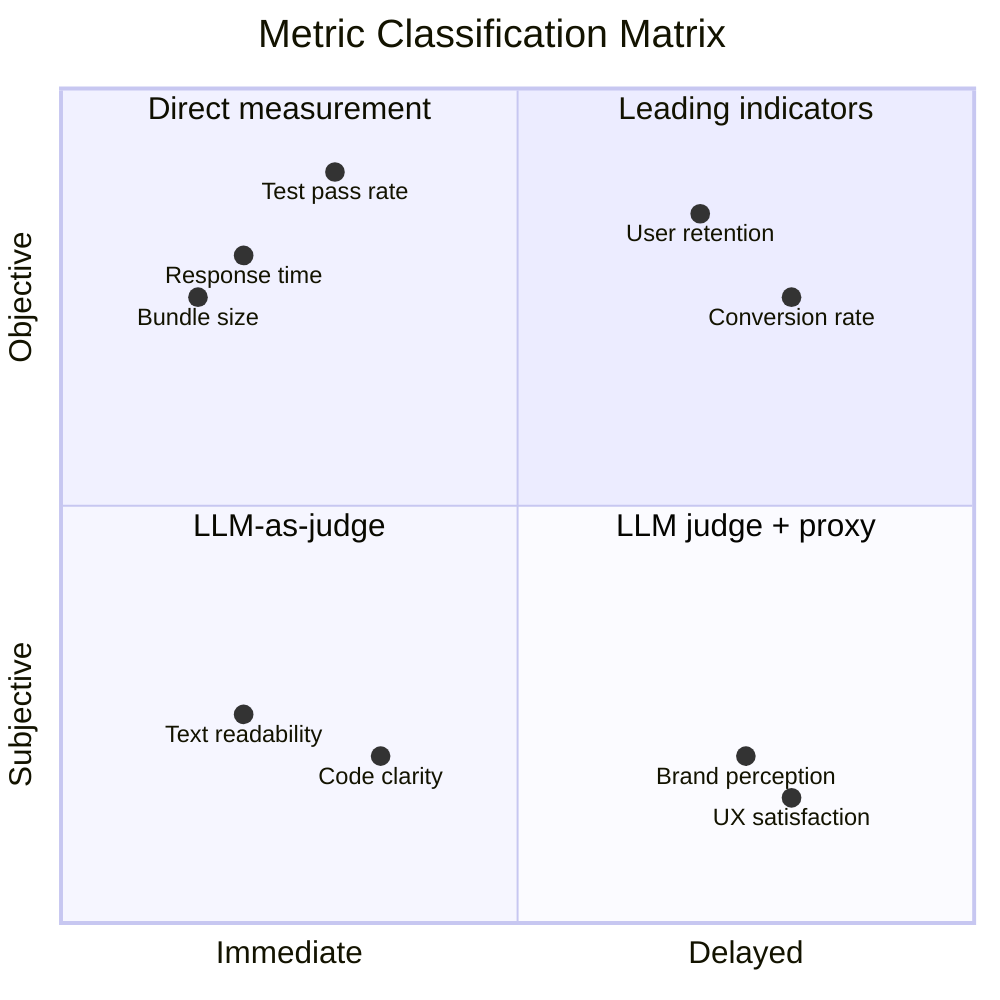

<p align="center">
  
</p>

# Sindri

[한국어](README_KO.md)

Autonomous improvement loop framework.
Write one `evaluate()` function, let the LLM iterate forever.

## Why Sindri

Inspired by Andrej Karpathy's [autoresearch](https://github.com/karpathy/autoresearch),
where an LLM agent autonomously runs ML experiments in a loop.
The concept, now often called the "Karpathy loop," has been adopted by
a growing number of engineers to let agents iterate overnight.

But for most people, it's still abstract. You hear about it, you think it sounds
powerful, but you don't know where to start. What do you measure? How do you
keep the loop from stalling? How do you apply it outside of ML training?

That was us. So we built Sindri to make this accessible.

The agent would run for an hour, maybe two, then stall.
It would repeat the same failed approach three times in a row.
It would stop and ask "should I continue?" at 3am.
It would silently break something, keep going, and waste 20 cycles.
Getting a loop to genuinely run for hours, unattended, improving something real,
turned out to be surprisingly hard.

So we kept at it. And the thing that surprised us was how simple the core idea is.
You need three things: a function that scores the current state,
the files the agent is allowed to change, and a set of rules to follow.
That's the entire framework. Everything else is details.

We wanted to make this easy to drop into any project.
Not just optimizing existing code. Starting from scratch works too.
The "artifact" can be anything: source code, prompts, ad copy, config files.

The real value here is not intelligence. It's time.
Tokens can be bought. Time cannot.
You try 3 ideas a day. An overnight loop tries 30.
Same quality of thinking, 10x more attempts, zero extra hours.

The genuinely hard part is designing the metric.
Performance in milliseconds? Easy. Test pass rate? Easy.
But what about logo aesthetics? UX quality? Tone of voice?
These don't produce a clean number.

We found that a 2x2 classification helps: objective vs subjective, immediate vs delayed.
Subjective criteria can use LLM-as-judge: break them into binary questions
the model answers consistently.
(Asking an LLM to rate something "7 out of 10" gives you a different number every time.
Asking "is the text readable against the background, yes or no" is stable.)
Delayed metrics can be approximated with leading indicators you can measure right now.



Mapping real problems onto this matrix is still something we're figuring out.
The patterns are there, but they need more cases to become reliable.
Sindri is both the tool and the testbed for that ongoing work.

## Getting Started

### Install

**Claude Code plugin (recommended):**

From terminal:
```bash
claude plugin marketplace add Taehyeon-Kim/sindri
claude plugin install sindri@sindri
```

Or from inside Claude Code:
```
/plugin marketplace add Taehyeon-Kim/sindri
/plugin install sindri@sindri
```

**Codex CLI:**

Tell Codex:
```
Fetch and follow instructions from https://raw.githubusercontent.com/Taehyeon-Kim/sindri/main/.codex/INSTALL.md
```

Or install manually:
```bash
git clone https://github.com/Taehyeon-Kim/sindri.git ~/.codex/sindri
cd ~/.codex/sindri && bun install && bun link
mkdir -p ~/.agents/skills
ln -s ~/.codex/sindri/skills ~/.agents/skills/sindri
```

See [.codex/INSTALL.md](.codex/INSTALL.md) for details and Windows instructions.

**Manual install (requires [Bun](https://bun.sh)):**

```bash
git clone https://github.com/Taehyeon-Kim/sindri.git
cd sindri
bun install
bun link
```

### Initialize

```bash
cd your-project
sindri init
```

This creates `.sindri/` with default config and templates:

```
.sindri/
  config.yaml      experiment settings
  evaluate.ts      your scoring function (implement this)
  run.ts           calls evaluate, prints score (do not edit)
  agents.md        agent instructions for the loop
  results/         experiment history (per branch, JSONL)
```

### Configure

Edit `.sindri/config.yaml` to match your project:

```yaml
name: your-project
artifact: src/              # what the agent modifies
run: npm start              # how to run the project
timeout: 900                # seconds per cycle
backtrack: 3                # revert after N consecutive failures
branches: 1                 # 1 = single loop, 2+ = parallel exploration
```

### Implement the evaluate function

This is the most important step. Open `.sindri/evaluate.ts` and write a function
that scores the current state. Higher is better.

```typescript
// example: test pass rate
export function evaluate(): number {
  const result = JSON.parse(readFileSync("test-results.json", "utf-8"))
  return result.passed / result.total
}
```

If you use the sindri Claude Code plugin, `/sindri init` will guide you through
metric design interactively, helping you pick the right pattern for your domain.

### Add domain context

Edit the `Domain Context` section at the bottom of `.sindri/agents.md`.
Describe what the project does, what you want to improve, and any constraints.
The agent reads this to understand what it's working on.

### Run the loop

Open a new Claude Code or Codex CLI session and start the autonomous loop:

```bash
claude "/sindri loop"    # Claude Code
```

Codex CLI:
```
sindri loop
```

The agent will read `.sindri/agents.md`, establish a baseline, and begin
the hypothesize, modify, evaluate, keep/discard cycle. It runs until
you stop it. Check on progress anytime:

```bash
sindri status               # current branch stats
sindri results              # full experiment history
```

### Resume after interruption

If the session ends, start a new one and run `/sindri loop` again.
The agent picks up from the last kept commit automatically by reading
`.sindri/results/<branch>.jsonl`.

### Scheduled cycles (for delayed feedback domains)

For domains where data needs time to accumulate between cycles
(ad copy CTR, A/B tests, SEO rankings), use `/sindri cycle` instead of `/sindri loop`.

Each invocation runs exactly one experiment cycle and stops.
Call it periodically when new data is available.

Set the schedule field in config.yaml (seconds between cycles):
```yaml
schedule: 0             # continuous (default)
schedule: 1800          # every 30 minutes
schedule: 21600         # every 6 hours
```

## Commands

CLI:
```
sindri init      Create .sindri/ with defaults and templates
sindri status    Show experiment stats for current branch
sindri results   Print full JSONL history
sindri clean     Prune dead git worktrees
```

Inside Claude Code or Codex CLI:
```
/sindri init     Interactive project setup with metric design
/sindri loop     Start continuous experiment loop
/sindri cycle    Run exactly one experiment cycle
```

## How It Works

Sindri is infrastructure, not an orchestrator. The agent drives the loop.

1. You write `evaluate()` to score the current state
2. The agent reads `.sindri/agents.md` and loops forever:
   hypothesize, modify, commit, run, evaluate, keep or discard
3. Each cycle is logged to `.sindri/results/<branch>.jsonl`
4. After consecutive failures, the agent backtracks to the last success
5. Results survive across sessions for automatic resume

## License

[MIT](LICENSE)
