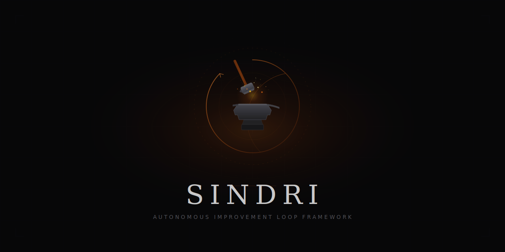
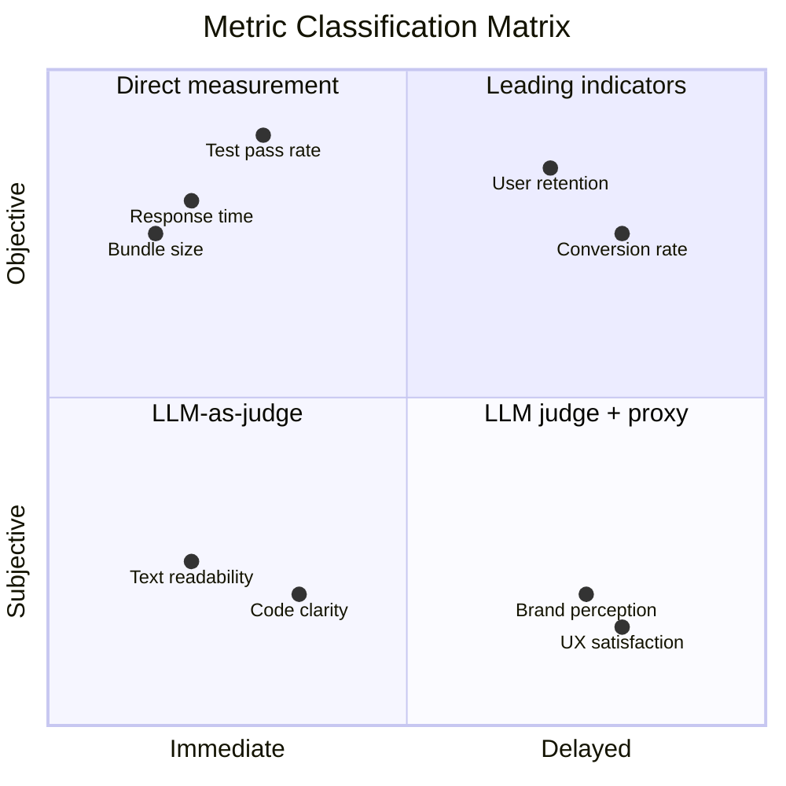

<p align="center">
  
</p>

# Sindri

[English](README.md)

자율 개선 루프 프레임워크입니다.
`evaluate()` 함수 하나만 작성하면, LLM이 알아서 반복 개선해줍니다.

## Why Sindri

Andrej Karpathy의 [autoresearch](https://github.com/karpathy/autoresearch)를 보고 시작했습니다.
LLM 에이전트가 ML 실험을 자율적으로 반복하는 프로젝트인데요,
요즘은 "Karpathy loop"라는 이름으로 많은 엔지니어들이 활용하고 있죠.
자는 동안 에이전트가 알아서 수십 번 실험을 돌려준다니, 정말 매력적인 이야기입니다.

그런데 막상 해보려고 하면 막막합니다.
뭘 측정해야 하는지, 루프가 멈추지 않게 하려면 어떻게 해야 하는지,
ML 학습 말고 다른 곳에는 어떻게 적용하는 건지.
주변에서 "나는 밤새 50번 돌렸어"라는 이야기를 들으면
대체 어떻게 하는 건지 감이 안 오기도 합니다.

저도 정확히 그런 상태였습니다.

직접 해봤는데, 에이전트가 한두 시간 돌다가 멈추더라고요.
같은 실패를 열 번 연속 반복하질 않나,
새벽 3시에 "계속할까요?"라고 물어보질 않나,
뭔가 깨뜨린 채로 20사이클을 허비하질 않나.
몇 시간 동안 무인으로, 진짜 뭔가를 개선하면서 돌리는 건
생각보다 훨씬 어려운 일이었습니다.

그래서 계속 파고들었는데, 놀랐던 건 핵심이 정말 단순하다는 점이었습니다.
필요한 건 딱 3가지예요.
현재 상태를 점수로 매기는 함수, 에이전트가 바꿀 수 있는 파일, 그리고 따를 규칙.
그게 전부입니다. 프레임워크의 본질은 이것뿐이고, 나머지는 부수적인 것들이에요.

이걸 아무 프로젝트에나 쉽게 붙일 수 있게 만들고 싶었습니다.
기존 코드를 최적화하는 것만이 아니라, 아무것도 없는 상태에서 시작하는 것도 됩니다.
소스 코드, 프롬프트, 광고 카피, 설정 파일 등 어떤 산출물이든 대상이 될 수 있어요.

여기서 진짜 가치는 지능이 아니라 시간입니다.
토큰은 돈으로 살 수 있지만, 시간은 살 수 없거든요.
하루에 아이디어 3개를 시도하는 것과 밤새 30개를 시도하는 것,
같은 수준의 사고인데 시도 횟수가 10배입니다.

사실 진짜 어렵고 중요한 부분은 메트릭 설계입니다.
응답 속도나 테스트 통과율 같은 건 쉽죠. 숫자가 바로 나오니까요.
그런데 로고가 예쁜지, UX가 좋은지, 문장의 톤이 맞는지 같은 건 어떡할까요?
이런 건 깔끔한 숫자로 나오지 않습니다.

여기서 2x2 분류 매트릭스로 개념을 정리해보았습니다.
객관 vs 주관, 즉시 vs 지연.

주관적인 기준은 LLM-as-judge 방식으로 이진 질문으로 분해하면 일관되게 판단할 수 있습니다.
"10점 만점에 몇 점?"이라고 물으면 매번 다른 답이 나오지만,
"텍스트가 배경 대비 읽히나요?"라고 물으면 답이 안정적이거든요.
지연 메트릭은 지금 바로 측정 가능한 선행지표(proxy)로 대체할 수 있고요.



실제 문제를 이 매트릭스에 매핑하는 건 솔직히 아직 연구 중입니다.
패턴은 보이는데, 확신하려면 더 많은 사례가 필요합니다.
Sindri는 그 연구를 위한 도구이기도 하고, 테스트베드이기도 합니다.

## 시작하기

### 설치

**Claude Code 플러그인 (권장):**

터미널에서:
```bash
claude plugin marketplace add Taehyeon-Kim/sindri
claude plugin install sindri@sindri
```

또는 Claude Code 세션 안에서:
```
/plugin marketplace add Taehyeon-Kim/sindri
/plugin install sindri@sindri
```

**수동 설치 ([Bun](https://bun.sh) 필요):**

```bash
git clone https://github.com/Taehyeon-Kim/sindri.git
cd sindri
bun install
bun link
```

### 초기화

```bash
cd your-project
sindri init
```

`.sindri/` 폴더가 기본 설정과 템플릿으로 생성됩니다:

```
.sindri/
  config.yaml      실험 설정
  evaluate.ts      점수 함수 (이것만 구현하시면 됩니다)
  run.ts           evaluate를 호출하고 점수를 출력합니다 (수정하지 마세요)
  agents.md        자율 루프를 위한 에이전트 지침
  results/         실험 히스토리 (브랜치별, JSONL)
```

### 설정

`.sindri/config.yaml`을 프로젝트에 맞게 수정해주세요:

```yaml
name: your-project
artifact: src/              # 에이전트가 수정하는 대상
run: npm start              # 프로젝트 실행 명령
timeout: 900                # 사이클당 제한 시간 (초)
backtrack: 3                # 연속 N회 실패 시 복귀
branches: 1                 # 1 = 단일 루프, 2+ = 병렬 탐색
```

### evaluate 함수 구현

가장 중요한 단계입니다. `.sindri/evaluate.ts`를 열고
현재 상태를 점수로 매기는 함수를 작성하세요. 높을수록 좋습니다.

```typescript
// 예시: 테스트 통과율
export function evaluate(): number {
  const result = JSON.parse(readFileSync("test-results.json", "utf-8"))
  return result.passed / result.total
}
```

Sindri Claude Code 플러그인을 사용하시면 `/sindri:init`이
메트릭 설계를 대화형으로 가이드해줍니다.

### 도메인 컨텍스트 추가

`.sindri/agents.md` 하단의 `Domain Context` 섹션을 작성해주세요.
프로젝트가 무엇을 하는지, 무엇을 개선하고 싶은지, 제약 조건은 무엇인지 적어주시면 됩니다.
에이전트가 이 내용을 읽고 작업 맥락을 파악합니다.

### 루프 실행

새 Claude Code 세션을 열고 자율 루프를 시작합니다:

```bash
claude "/sindri:loop"
```

에이전트가 `.sindri/agents.md`를 읽고, 베이스라인을 잡은 뒤
가설 수립, 수정, 평가, 유지/폐기 사이클을 시작합니다.
직접 멈추기 전까지 계속 돌아갑니다. 진행 상황은 언제든 확인하실 수 있어요:

```bash
sindri status               # 현재 브랜치 통계
sindri results              # 전체 실험 히스토리
```

### 중단 후 재개

세션이 끝나면, 새 세션을 열고 `/sindri:loop`을 다시 실행하세요.
에이전트가 `.sindri/results/<branch>.jsonl`을 읽어서
마지막 유지된 커밋부터 자동으로 이어서 실험합니다.

### 스케줄 사이클 (지연 피드백 도메인)

사이클 사이에 데이터가 쌓여야 하는 도메인
(광고 카피 CTR, A/B 테스트, SEO 순위 등)에서는 `/sindri:loop` 대신 `/sindri:cycle`을 사용하세요.

한 번 호출하면 정확히 한 사이클만 실행하고 멈춥니다.
새 데이터가 들어왔을 때 주기적으로 호출하면 됩니다.

config.yaml의 schedule 필드로 사이클 간격을 설정하세요 (초 단위):
```yaml
schedule: 0             # 연속 실행 (기본값)
schedule: 1800          # 30분마다
schedule: 21600         # 6시간마다
```

## 명령어

CLI:
```
sindri init      .sindri/를 기본 설정과 템플릿으로 생성합니다
sindri status    현재 브랜치의 실험 통계를 보여줍니다
sindri results   전체 JSONL 히스토리를 출력합니다
sindri clean     죽은 git worktree를 정리합니다
```

Claude Code 내부:
```
/sindri:init     대화형 프로젝트 설정 및 메트릭 설계
/sindri:loop     연속 실험 루프 시작
/sindri:cycle    정확히 한 사이클만 실행
```

## 동작 원리

Sindri는 인프라입니다. 오케스트레이터가 아닙니다. 에이전트가 루프를 돌립니다.

1. `evaluate()`를 작성해서 현재 상태를 점수로 매깁니다
2. 에이전트가 `.sindri/agents.md`를 읽고 무한 루프에 진입합니다:
   가설 수립, 수정, 커밋, 실행, 평가, 유지 또는 폐기
3. 매 사이클이 `.sindri/results/<branch>.jsonl`에 기록됩니다
4. 연속 실패 시 마지막 성공 지점으로 백트래킹합니다
5. 결과가 세션 간에 유지되어 자동 재개가 가능합니다

## 라이선스

[MIT](LICENSE)
